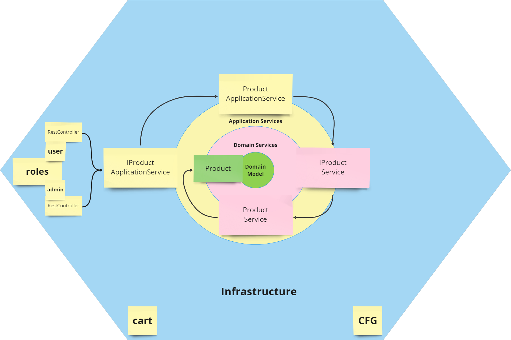

##Description
This project demonstrates a Java Spring Boot microservice designed to manage products and categories (core models). 
It follows the principles of Hexagonal and Onion Architecture.

##Tests

Unit tests are written for Domain Services.
Integration tests are written for ApplicationService/s.
Integration tests are written for role based RestControllers.
